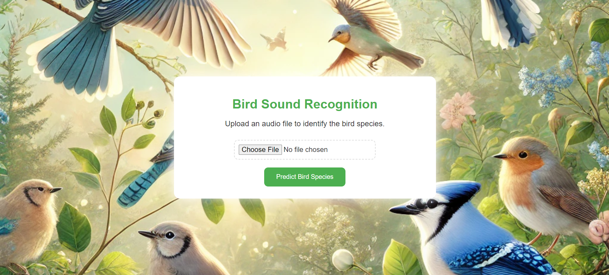
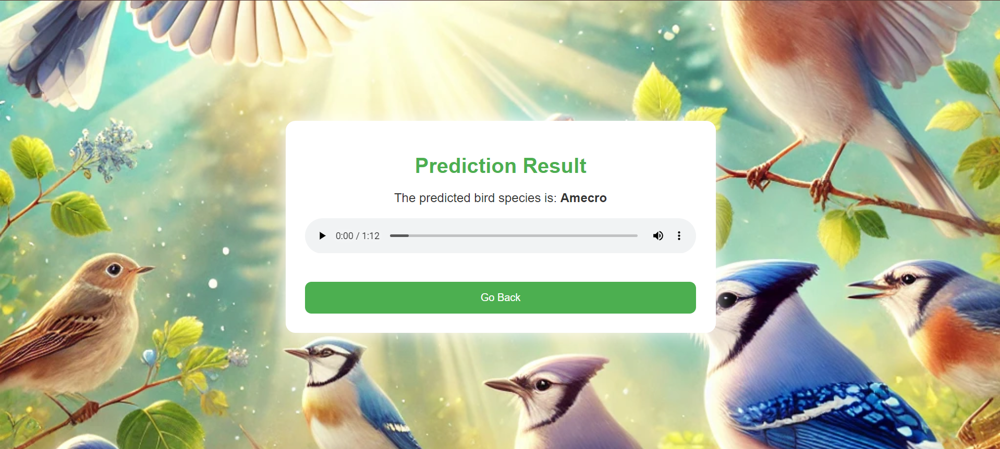

# Bird Sound Recognizer

This project is a web application that recognizes bird species from audio files using a pre-trained model. The project involves building a model, creating a Flask-based web interface, and displaying various metrics related to the model's performance.

## Project Structure

- **app.py**: The main Flask application script that handles routes and logic for uploading and predicting bird species from audio files.
- **static/**: Contains static assets like CSS, images, and JavaScript.
  - **css/**: Stylesheets for the web application.
  - **images/**: Background images and other visual assets used in the project.
- **templates/**: HTML templates for the web pages.
  - **index.html**: The main page where users can upload audio files.
  - **result.html**: The page that displays the prediction result and plays the uploaded audio file.
- **uploads/**: Stores uploaded audio files temporarily for processing.
- **Data/**: This directory is excluded from the repository and contains the raw data used for training the model.
- **Metrics/**: Stores the output metrics of the model.
  - **Confusion_Matrix.png**: Confusion matrix visualizing the performance of the model.
  - **model_accuracy.png**: Graph displaying the accuracy of the model over training epochs.
  - **Scores.png**: Precision, recall, and F1 score for each class.
  - **predicted_classes.npy**: Numpy array of predicted classes.
  - **true_classes.npy**: Numpy array of true classes.
- **bird_sound_recognition_model.h5**: The pre-trained model file used in the application.
- **label_encoder.pkl**: The label encoder for mapping species names to class indices.
- **main.ipynb**: Jupyter Notebook used for training the model and analyzing metrics.

## How to Run

1. Clone the repository:
   ```bash
   git clone https://github.com/SrihariMurali01/Bird-Sound-Recogniser.git
   ```
2. Navigate to the project directory:
   ```bash
   cd Bird-Sound-Recogniser
   ```
3. Install the required dependencies:
   ```bash
   pip install -r requirements.txt
   ```
4. Start the Flask application:
   ```bash
   python app.py
   ```
5. Access the application in your web browser at `http://127.0.0.1:5000/`.

## Usage

- **Upload an Audio File**: On the home page, upload an audio file to identify the bird species.
- **Prediction Result**: The application will predict the bird species, display the result, and allow you to play the uploaded audio.

## Model Metrics

To view detailed metrics of the model, navigate to the [Metrics](./Metrics) folder. This folder includes:

- **Confusion_Matrix.png**: Visualizes the performance of the model by showing the confusion matrix.
- **model_accuracy.png**: Displays the accuracy of the model over training epochs.
- **Scores.png**: Shows the precision, recall, and F1 score for each class.
- **predicted_classes.npy**: Numpy array of predicted classes.
- **true_classes.npy**: Numpy array of true classes.

## Excluded Files

- The `Data/` directory containing training data is excluded from the repository to keep the repository size manageable.

## Snapshots

- Main Page:

  
<br><br>

- Predictions:
  
  
